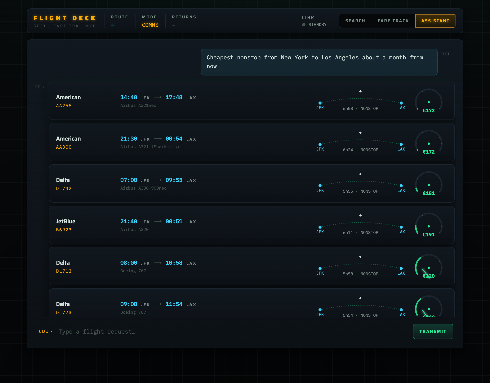

# FLIGHT DECK — Flight Search, Fare Tracker & AI Assistant

An avionics-grade flight app. A Python **MCP server** wraps the
[`fli`](https://github.com/punitarani/fli) library (Google Flights) and exposes
clean tools; a **Next.js** frontend with a **cockpit instrumentation** aesthetic
consumes them — both through a manual instrument UI and through a **conversational
AI assistant** (Google Gemini) that uses the **MCP server as its toolset**.

Built with **GitHub spec-kit-style spec-driven development** — every decision is
written down, and `git log` replays the build in order. Two feature specs:
[001 search & fares](specs/001-flight-search-fares/spec.md),
[002 conversational search](specs/002-conversational-search/spec.md).




---

## What it does
- **Assistant (the point of the project)** — type in plain language ("cheapest
  nonstop NYC→LA about a month out", "when's cheapest JFK→LAX in early July?").
  **Gemini** resolves airports, infers dates, and calls the **MCP tools** itself,
  then the chat renders the *real* results as instrument readouts. You never search
  manually.
- **Search** — origin, destination, date → real itineraries as MFD readout rows:
  cyan times, flight number, a routing **duration arc** with stop dots, and a
  radial **price gauge**.
- **Fare Track** — a route + date window → a heat-graded calendar of the cheapest
  fare per day (green → amber → red). Click a day to drill into its flights.
- **Airport autocomplete** — free text ("new york") resolves to airports
  (JFK/LGA/EWR) over `fli`'s 7835-airport enum + a curated metro-alias table.

Real Google Flights data via `fli` (no key). The assistant needs a free Google AI
Studio key (server-side only).

## Architecture
```
Browser (cockpit UI)
   │  /api/search|fares|airports (JSON)          /api/chat (streamed)
   ▼                                                 ▼
Next.js route handlers                       Next.js /api/chat
   │                                            │  streamText(Gemini, tools)
   │                                            │  tool.execute() ↓
   └──────── MCP client (Streamable HTTP) ──────┴──► flight-mcp (Python, FastMCP)
        web/lib/mcp.ts                                  mcp-server/server.py
                                                            │ imports
                                                            ▼
                                                        fli → Google Flights
```
The browser never speaks MCP — server routes are the MCP client. The **AI
assistant** is just Gemini whose three tools `execute()` straight into that same
MCP client, so its toolset *is* the MCP server (no hallucinated flights). The MCP
server also runs over **stdio** for Claude Desktop. See
[ADR-0004](docs/adr/0004-mcp-transport-and-frontend-wiring.md),
[ADR-0007](docs/adr/0007-conversational-agent-over-mcp.md).

## Run it
See [`quickstart.md`](specs/001-flight-search-fares/quickstart.md).
TL;DR — two terminals:
```bash
# terminal 1 — MCP server
cd mcp-server && python3 -m venv .venv && .venv/bin/pip install -r requirements.txt
.venv/bin/python server.py --http
# terminal 2 — web
cd web && npm install && cp .env.example .env.local
# add your free Google AI Studio key to web/.env.local for the Assistant:
#   GOOGLE_GENERATIVE_AI_API_KEY=...   (https://aistudio.google.com/apikey)
npm run dev                                              # localhost:3000
```
Search and Fare Track work without a key; the **Assistant** tab needs the Gemini
key (server-side only — never sent to the browser, never committed).

## Repo layout / where the learning lives
| path | what |
|------|------|
| [`.specify/memory/constitution.md`](.specify/memory/constitution.md) | the 7 governing principles |
| [`specs/001-flight-search-fares/`](specs/001-flight-search-fares/) | spec + research + plan + data-model + contracts + tasks + quickstart |
| [`specs/002-conversational-search/`](specs/002-conversational-search/) | the AI-assistant spec, plan, chat-API contract, tasks |
| [`docs/adr/`](docs/adr/) | one ADR per meaningful decision (0001–0008) |
| [`docs/design/cockpit-language.md`](docs/design/cockpit-language.md) | the design language + tokens + screenshots |
| [`mcp-server/`](mcp-server/) | the Python MCP server (3 tools, fli mapping, airport matcher) |
| [`web/`](web/) | the Next.js cockpit frontend (`app/api/chat`, `lib/flightTools.ts`, `components/Comms.tsx`) |

## How to replay the build
`git log --oneline` reads top-to-bottom as: **constitution → spec + research →
ADRs + design → plan + contracts + tasks → MCP server → web API → cockpit UI →
this README.** Implementation commits reference the `tasks.md` IDs (`T0xx`).

## Key decisions (full reasoning in `docs/adr/`)
1. **`fli` is the single data source** — adopted only after a live probe returned
   99 real JFK→LAX offers ([ADR-0001](docs/adr/0001-fli-as-flight-data-source.md)).
2. **Our own MCP server** wraps the `fli` library (vs reusing bundled `fli-mcp`)
   to freeze frontend-shaped JSON and add `resolve_airport`
   ([ADR-0002](docs/adr/0002-custom-mcp-server-over-bundled-fli-mcp.md)).
3. **"Tracking" = fare tracking, not live aircraft** — `fli` has no live position
   data; we kept one source ([ADR-0003](docs/adr/0003-fare-tracking-not-live-aircraft-tracking.md)).
4. **MCP over Streamable HTTP; Next.js server is the MCP client**
   ([ADR-0004](docs/adr/0004-mcp-transport-and-frontend-wiring.md)).
5. **Cockpit-instrumentation design language**
   ([ADR-0005](docs/adr/0005-cockpit-instrumentation-design-language.md)).
6. **Spec-kit replicated by hand** + commit discipline
   ([ADR-0006](docs/adr/0006-spec-kit-style-process.md)).
7. **Conversational agent via Vercel AI SDK**, tools execute through the MCP
   client (v6 dropped the in-core MCP client)
   ([ADR-0007](docs/adr/0007-conversational-agent-over-mcp.md)).
8. **Gemini `gemini-2.5-flash`** (free-tier verified) with **server-only key**
   handling ([ADR-0008](docs/adr/0008-gemini-model-and-secret-handling.md)).

## Tech
Python 3.14 · `flights` (fli) · `mcp` (FastMCP) · Next.js 16 (App Router, TS) ·
`@modelcontextprotocol/sdk` · Vercel **AI SDK v6** + `@ai-sdk/google` (Gemini) ·
Motion · IBM Plex Mono + Saira.

> Disclaimer: `fli` uses Google Flights' private API (unofficial). For learning
> and personal use; prices are indicative.
