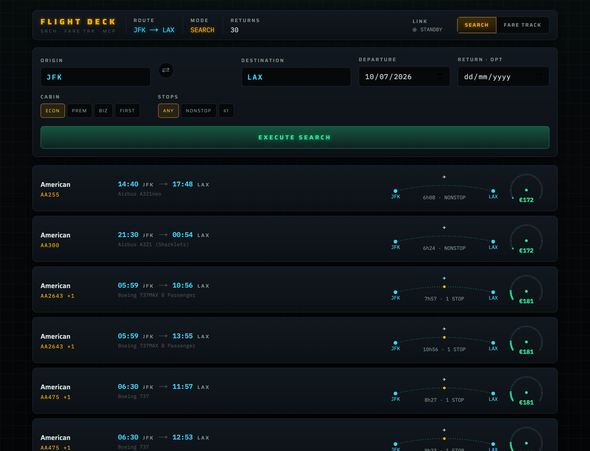
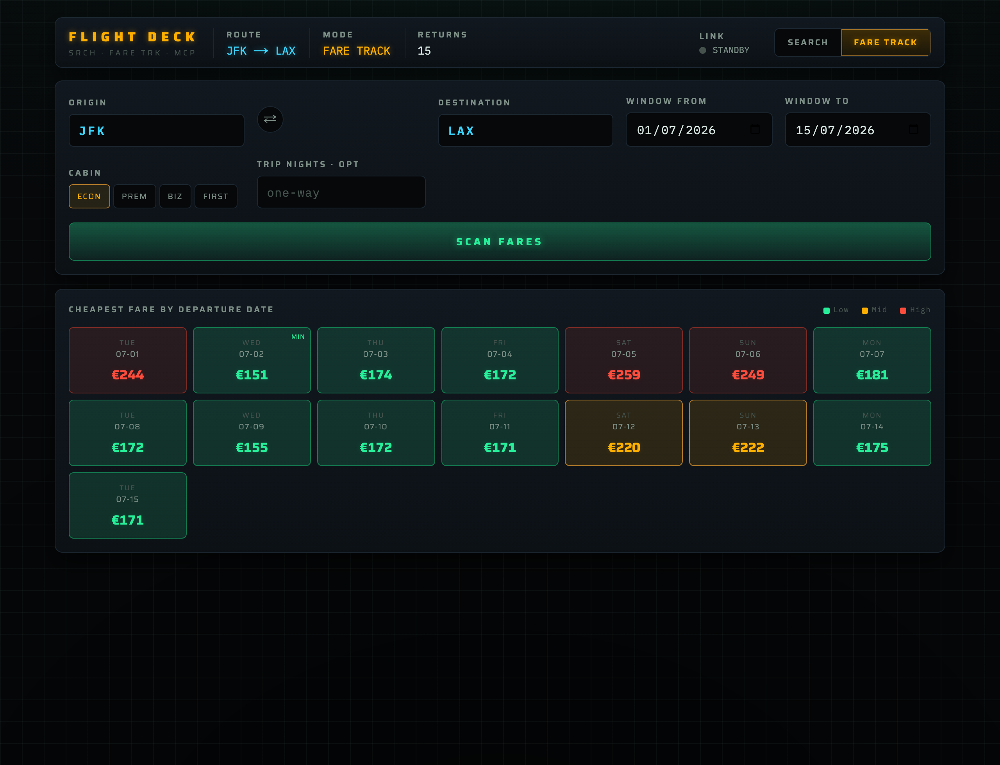

# FLIGHT DECK — Flight Search & Fare Tracker

An avionics-grade flight **search** and **fare-tracking** app. A Python **MCP
server** wraps the [`fli`](https://github.com/punitarani/fli) library (Google
Flights) and exposes clean tools; a **Next.js** frontend with a **cockpit
instrumentation** aesthetic consumes them through server-side MCP-client routes.

Built with **GitHub spec-kit-style spec-driven development** — every decision is
written down, and `git log` replays the build in order.




---

## What it does
- **Search** — origin, destination, date → real itineraries ranked by price, each
  shown as an MFD readout row: cyan times, flight number, a routing **duration
  arc** with stop dots, and a radial **price gauge**.
- **Fare Track** — a route + date window → a heat-graded calendar of the cheapest
  fare per day (green → amber → red). Click a day to drill into its flights.
- **Airport autocomplete** — free text ("new york") resolves to airports
  (JFK/LGA/EWR) over `fli`'s 7835-airport enum + a curated metro-alias table.

No API keys. No scraping. Real Google Flights data via `fli`.

## Architecture
```
Browser (cockpit UI)
   │  fetch /api/*   (plain JSON only — the browser never speaks MCP)
   ▼
Next.js route handlers ──MCP client (Streamable HTTP)──► flight-mcp (Python, FastMCP)
   web/app/api/*                                          mcp-server/server.py
                                                              │ imports
                                                              ▼
                                                          fli → Google Flights
```
The same MCP server also runs over **stdio** for Claude Desktop. See
[ADR-0004](docs/adr/0004-mcp-transport-and-frontend-wiring.md).

## Run it
See [`specs/001-flight-search-fares/quickstart.md`](specs/001-flight-search-fares/quickstart.md).
TL;DR — two terminals:
```bash
# terminal 1
cd mcp-server && python3 -m venv .venv && .venv/bin/pip install -r requirements.txt
.venv/bin/python server.py --http
# terminal 2
cd web && npm install && cp .env.example .env.local && npm run dev   # localhost:3000
```

## Repo layout / where the learning lives
| path | what |
|------|------|
| [`.specify/memory/constitution.md`](.specify/memory/constitution.md) | the 7 governing principles |
| [`specs/001-flight-search-fares/`](specs/001-flight-search-fares/) | `spec.md` (what/why), `research.md` (live probes), `plan.md` (how), `data-model.md`, `contracts/`, `tasks.md`, `quickstart.md` |
| [`docs/adr/`](docs/adr/) | one ADR per meaningful decision (0001–0006) |
| [`docs/design/cockpit-language.md`](docs/design/cockpit-language.md) | the design language + tokens + screenshots |
| [`mcp-server/`](mcp-server/) | the Python MCP server (3 tools, fli mapping, airport matcher) |
| [`web/`](web/) | the Next.js cockpit frontend |

## How to replay the build
`git log --oneline` reads top-to-bottom as: **constitution → spec + research →
ADRs + design → plan + contracts + tasks → MCP server → web API → cockpit UI →
this README.** Implementation commits reference the `tasks.md` IDs (`T0xx`).

## Key decisions (full reasoning in `docs/adr/`)
1. **`fli` is the single data source** — adopted only after a live probe returned
   99 real JFK→LAX offers ([ADR-0001](docs/adr/0001-fli-as-flight-data-source.md)).
2. **Our own MCP server** wraps the `fli` library (vs reusing bundled `fli-mcp`)
   to freeze frontend-shaped JSON and add `resolve_airport`
   ([ADR-0002](docs/adr/0002-custom-mcp-server-over-bundled-fli-mcp.md)).
3. **"Tracking" = fare tracking, not live aircraft** — `fli` has no live position
   data; we kept one source ([ADR-0003](docs/adr/0003-fare-tracking-not-live-aircraft-tracking.md)).
4. **MCP over Streamable HTTP; Next.js server is the MCP client**
   ([ADR-0004](docs/adr/0004-mcp-transport-and-frontend-wiring.md)).
5. **Cockpit-instrumentation design language**
   ([ADR-0005](docs/adr/0005-cockpit-instrumentation-design-language.md)).
6. **Spec-kit replicated by hand** + commit discipline
   ([ADR-0006](docs/adr/0006-spec-kit-style-process.md)).

## Tech
Python 3.14 · `flights` (fli) · `mcp` (FastMCP) · Next.js 16 (App Router, TS) ·
`@modelcontextprotocol/sdk` · Motion · IBM Plex Mono + Saira.

> Disclaimer: `fli` uses Google Flights' private API (unofficial). For learning
> and personal use; prices are indicative.
