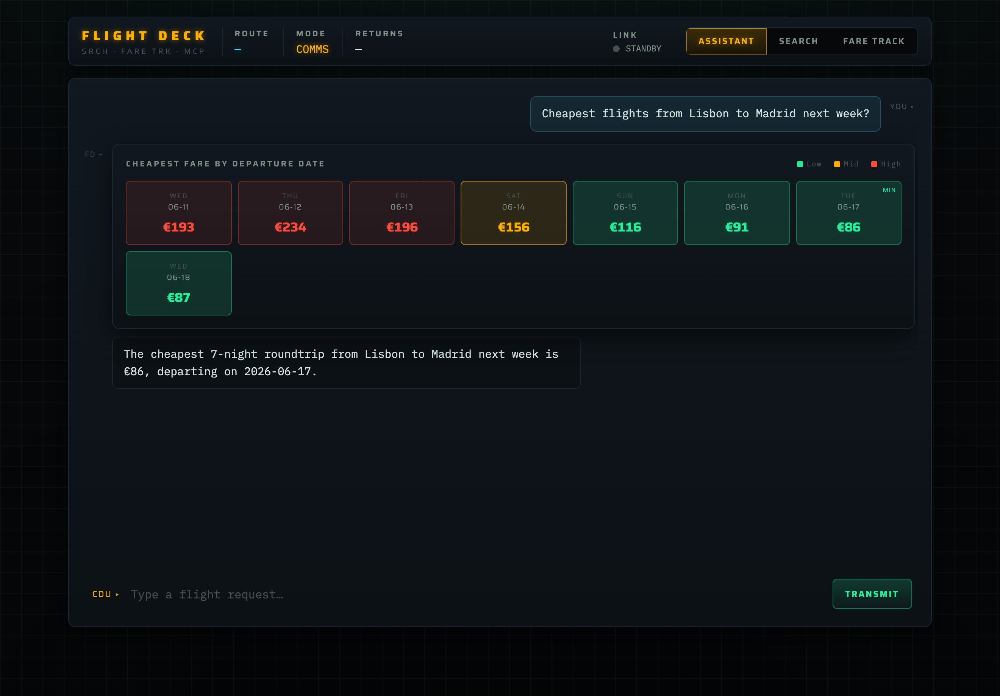
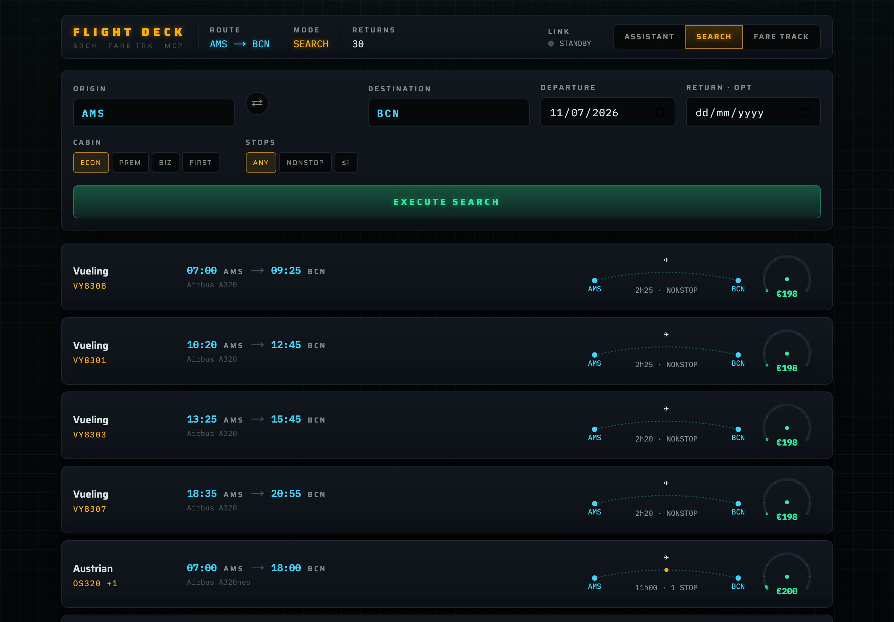
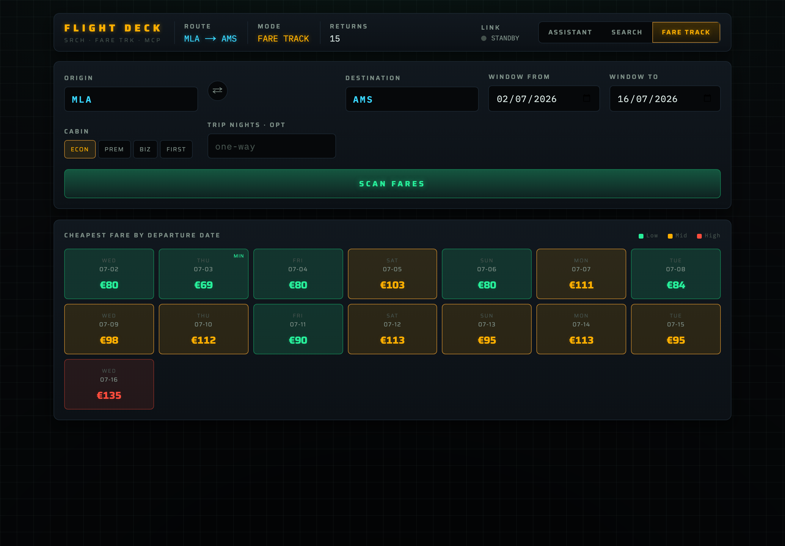
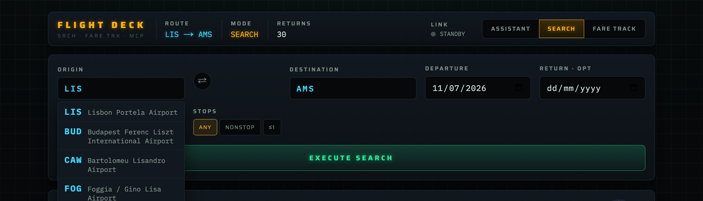

# FLIGHT DECK

Flight search, fare tracking, and an AI assistant, built spec first. A Python
**MCP server** wraps the [`fli`](https://github.com/punitarani/fli) library
(Google Flights) and exposes clean tools. A **Next.js** frontend with a cockpit
instrumentation look consumes those tools, both through a manual instrument UI and
through a conversational **AI assistant** (Google Gemini) that uses the **MCP
server as its toolset**.

Two ideas drive the project:

1. **Spec driven development** (GitHub spec kit style). Every decision is written
   down before the code, and `git log` replays the build in order.
2. **The Model Context Protocol (MCP)** as the integration backbone. The same MCP
   tools power the manual UI, the HTTP API, the LLM agent, and Claude Desktop.

## Screenshots

<!-- Drop images into docs/screenshots/ to fill these slots. -->

| Assistant | Search |
|:--:|:--:|
|  |  |
| **Fare Track** | **Command bar** |
|  |  |

## What it does

- **Assistant** (the main feature). Ask in plain language, for example
  "cheapest round flights from Malta to Amsterdam in June or July". Gemini resolves
  the airports, infers the dates, calls the MCP tools, and the chat renders the
  real results as instrument readouts. No manual searching.
- **Search**. A route and a date return real itineraries as readout rows with
  cyan times, flight numbers, a routing arc with stop dots, and a price gauge.
- **Fare Track**. A route and a date window return a heat graded calendar of the
  cheapest fare per day. Click a day to drill into that day's flights.

Real Google Flights data via `fli` (no key). The assistant needs a free Google AI
Studio key, read server side only.

## Architecture

```
Browser (cockpit UI)
   |  /api/search|fares|airports (JSON)          /api/chat (streamed)
   v                                                 v
Next.js route handlers                       Next.js /api/chat
   |                                            |  streamText(Gemini, tools)
   |                                            |  tool.execute() |
   +-------- MCP client (Streamable HTTP) ------+--> flight-mcp (Python, FastMCP)
        web/lib/mcp.ts                                mcp-server/server.py
                                                          |  imports
                                                          v
                                                      fli  ->  Google Flights
```

The browser never speaks MCP. Server routes are the MCP client. The assistant is
Gemini whose three tools `execute()` straight into that same MCP client, so its
toolset is the MCP server and it cannot fabricate flights. The MCP server also
runs over stdio for Claude Desktop. See
[ADR-0004](docs/adr/0004-mcp-transport-and-frontend-wiring.md) and
[ADR-0007](docs/adr/0007-conversational-agent-over-mcp.md).

## Spec driven development

The build follows GitHub spec kit's flow (constitution, spec, plan, contracts,
tasks, implement), reproduced by hand and encoded in the commit history.

| path | what |
|------|------|
| [`.specify/memory/constitution.md`](.specify/memory/constitution.md) | the seven governing principles |
| [`specs/001-flight-search-fares/`](specs/001-flight-search-fares/) | spec, research, plan, data model, contracts, tasks, quickstart |
| [`specs/002-conversational-search/`](specs/002-conversational-search/) | the AI assistant spec, plan, chat API contract, tasks |
| [`docs/adr/`](docs/adr/) | one ADR per meaningful decision (0001 to 0008) |
| [`docs/design/cockpit-language.md`](docs/design/cockpit-language.md) | the design language and tokens |

`git log --oneline` reads top to bottom as constitution, spec, ADRs, design, plan,
contracts, tasks, MCP server, web API, cockpit UI, AI assistant. Implementation
commits reference the `tasks.md` IDs.

## Getting started

**Prerequisites:** Python 3.12+ and Node 20+ (with npm). No paid services. Search
and Fare Track need no key; the Assistant needs a free Google AI Studio key.

**1. Clone**
```bash
git clone https://github.com/brahimi73837/flight_mcp.git
cd flight_mcp
```

**2. Start the MCP server** (terminal 1)
```bash
cd mcp-server
python3 -m venv .venv
.venv/bin/pip install -r requirements.txt
.venv/bin/python server.py --http        # Streamable HTTP on http://127.0.0.1:8000/mcp
```

**3. Configure the web app** (terminal 2)
```bash
cd web
npm install
cp .env.example .env.local
```
Set the key for the Assistant in `web/.env.local` (the other tabs work without it):
```
FLIGHT_MCP_URL=http://127.0.0.1:8000/mcp
GOOGLE_GENERATIVE_AI_API_KEY=YOUR_FREE_KEY    # https://aistudio.google.com/apikey
GEMINI_MODEL=gemini-2.5-flash
```
The key is read server side only. `.env.local` is gitignored, so it never lands in
git or the browser bundle.

**4. Start the web app**
```bash
npm run dev                               # http://localhost:3000
```

**5. Use it.** Open http://localhost:3000. Three tabs via the top right toggle:

- **Assistant**: just talk. Try "cheapest round flights from Malta to Amsterdam in
  June or July", then follow up with "make it nonstop".
- **Search**: enter a route (codes or city names) and a date, then Execute Search.
- **Fare Track**: set a route and a date window, then Scan Fares, and click a day.

**6. (Optional) Claude Desktop.** The same server speaks stdio, so any MCP client
can use the flight tools. Config snippet in [`mcp-server/README.md`](mcp-server/README.md).

## Testing

With both servers running:
```bash
cd web && npm run e2e
```
The runner exercises the whole stack against live data (the HTTP API and the Gemini
agent) and prints PASS, SKIP, or FAIL per acceptance criterion. It separates two
**external** conditions from real defects: Google Flights throttling its search
endpoint (the server retries and the test tries several routes), and the LLM free
tier rate limit (surfaced clearly and skipped, not failed).

## Key decisions

Full reasoning in [`docs/adr/`](docs/adr/):

1. `fli` as the single data source, adopted after a live probe (ADR-0001).
2. A custom MCP server wrapping the `fli` library, not the bundled one (ADR-0002).
3. "Tracking" delivered as fare tracking, since `fli` has no live position data (ADR-0003).
4. MCP over Streamable HTTP, with the Next.js server as the MCP client (ADR-0004).
5. A cockpit instrumentation design language (ADR-0005).
6. Spec kit reproduced by hand, with commit discipline (ADR-0006).
7. A conversational agent via the Vercel AI SDK, tools executing through the MCP client (ADR-0007).
8. Gemini `gemini-2.5-flash` (free tier) with server only key handling (ADR-0008).

## Tech

Python 3.14, `flights` (fli), `mcp` (FastMCP), Next.js 16 (App Router, TypeScript),
`@modelcontextprotocol/sdk`, Vercel AI SDK v6 with `@ai-sdk/google` (Gemini),
Motion, IBM Plex Mono and Saira.

> `fli` uses Google Flights' private API (unofficial), for personal use; prices are
> indicative. Google may rate limit heavy use from one IP. The server retries and
> the UI degrades gracefully.
